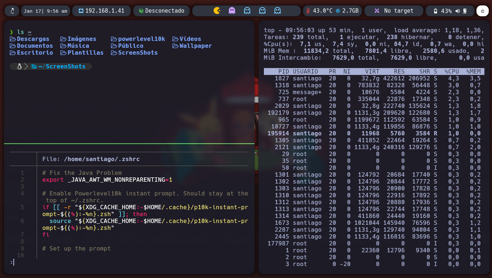
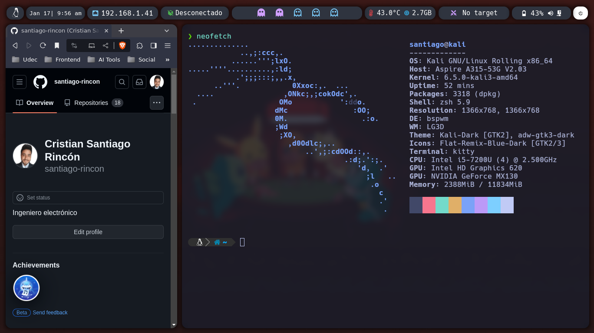

# Descripción
Configuración de un entorno de trabajo en Linux con [bspwm](https://github.com/baskerville/bspwm), [polybar](https://github.com/polybar/polybar), [picom](https://github.com/ibhagwan/picom), [kitty](https://github.com/kovidgoyal/kitty) y [rofi](https://github.com/davatorium/rofi).




# Instalación automática 
En este repositorio hay un script de autoinstalación habilitado, este puede fallar a medida que pasa el tiempo, por cambio de dependencias u otras razones. 
```bash
git clone https://github.com/santiago-rincon/dotfiles.git
cd dotfiles
chmod +x install.sh
./install.sh
```
# Instalación manual
## Instalación de dependencias
### bspwm 
bspwm es un gestor de ventanas en mosaico basado en la partición del espacio binario, este puede ser instalado a través de algunos gestores de paquetes en varias distribuciones(Arch Linux, Debian, Gentoo Linux, FreeBSD, Void Linux, BunsenLabs, Manjaro Linux, Chakra, Exherbo),o directamente desde su código fuente como se muestra en la [documentación de bspwm](https://github.com/baskerville/bspwm/blob/master/doc/INSTALL.md).
### sxhkd
sxhkd es un demonio de teclas de acceso rápido a X, este puede ser instalado a través de algunos gestores de paquetes en varias distribuciones(Arch Linux, Debian, Gentoo Linux, FreeBSD, Void Linux, BunsenLabs, Manjaro Linux, Chakra, Exherbo),o directamente desde su código fuente, este se instala de la misma forma que bspwm ([documentación de bspwm](https://github.com/baskerville/bspwm/blob/master/doc/INSTALL.md)).
### picom 
picom es un compositor ligero para X11, esta dependencia se debe instalar desde su código fuente debido a que es una modificación del picom original, por ende, se debe clonar el su [repositorio](https://github.com/ibhagwan/picom.git) y seguir los pasos de instalación que se muestran en la [documentación de picom](https://github.com/yshui/picom/tree/next)
A continuación, se muestra la lista de paquetes necesarios para distribuciones basadas en Debian.
```bash
sudo apt install cmake libxcb-xinerama0-dev libpcre3 libpcre3-dev libconfig-dev libdbus-1-dev libegl-dev libev-dev libgl-d
ev libpcre2-dev libpixman-1-dev libx11-xcb-dev libxcb1-dev libxcb-composite0-dev libxcb-damage0-dev libxcb-dpms0-dev libxc
b-glx0-dev libxcb-image0-dev libxcb-present-dev libxcb-randr0-dev libxcb-render0-dev libxcb-render-util0-dev libxcb-shape0
-dev libxcb-util-dev libxcb-xfixes0-dev libxext-dev meson ninja-build uthash-dev
```
### polybar 
polybar es una barra de estado rápida y fácil de usar para sistemas Linux, esta puede ser instalada a través de diferentes gestores de paquetes como se observa en la [lista de versiones disponibles para diferentes distribuciones](https://repology.org/project/polybar/versions), en caso de que polybar no este disponible para tu distribución o quieras instalar la última versión, puedes instalarla desde su código fuente como se muestra en la [documentación de polybar](https://github.com/polybar/polybar/wiki/Compiling).
### rofi
rofi es un conmutador de ventanas, lanzador de aplicaciones y sustituto de dmenu, este puede ser instalado a través de diferentes gestores de paquetes o desde su código fuente como se muestra en la [documentación de rofi](https://github.com/davatorium/rofi/blob/next/INSTALL.md).
### kitty
kitty es una terminal multiplataforma, rápida, rica en funciones y basada en GPU, la guía de instalación y configuración completa esta disponible en [este repositorio](https://github.com/santiago-rincon/linux_terminal.git).
### libinput-gestuares
libinput-gestuares permite realizar acciones a través de gestos en tu touchpad (para notebook) usando libinput, esta instalación es opcional. La instalación se realiza a desde su [repositorio de github](https://github.com/bulletmark/libinput-gestures/).
### Otros binarios
La instalación de otros binarios es necesaria para la correcta ejecución de algunos scripts
- [lsd](https://github.com/lsd-rs/lsd) (instalación manual) 
- [bat](https://github.com/sharkdp/bat) 
- [xclip](https://github.com/astrand/xclip)
- [locate](https://github.com/pr4k/locate)
- [feh](https://github.com/derf/feh)
- [scrot](https://github.com/dreamer/scrot) 
- build-essential
- [scrub](https://github.com/Shenhav-and-Korem-labs/SCRuB)
- [i3lock-color](https://github.com/Raymo111/i3lock-color)
- [ranger](https://github.com/ranger/ranger)
- pulseaudio-utils
- [brightnessctl](https://github.com/Hummer12007/brightnessctl)
- acpi
- [sponge](https://github.com/j1ah0ng/sponge)
- [alsa-utils](https://github.com/alsa-project/alsa-utils)
- lm-sensors
- nmtui

Instalación para distribuciones basadas en Debian: 

```bash
sudo apt install bat xclip locate feh scrot build-essential scrub i3lock-color ranger pulseaudio-utils brightnessctl acpi moreutils alsa-utils lm-sensors network-manager
```
### Fuentes
Al seguir los pasos de la instalación de Kitty se debieron instalar las fuentes _Hack Nerd Fonts_. En caso de no querer instalar kitty a continuación se muestra el proceso de instalación.
Como **usuario privilegiado (root)** nos dirigimos al directorio _/usr/share/fonts_ (o el equivalente en la distribución de trabajo) y descargamos el comprimido de las _Hack Nerd Fonts_ de la página oficial ([Hack Nerd Fonts](https://www.nerdfonts.com/)), posteriormente descomprimimos el archivo _.zip_ y lo eliminamos.

```bash
sudo su
cd /usr/share/fonts
wget https://github.com/ryanoasis/nerd-fonts/releases/download/vx.x.x/Hack.zip
unzip Hack.zip
rm Hack.zip
```
## Configuración del entorno
Una vez instaladas todas las dependencias con los archivos de configuración (carpeta `config`) disponibles en este repositorio se deben copiar a la ruta `~/.config`. **Este comando se debe ejecutar como usuario de bajos privilegios**
Posteriormente se debe crear una carpeta "ScreenShots"  y mover la carpeta "Wallpaper" disponible en este repositorio en la ruta `~/`.
En caso de haber instalado `libinput-gestuares` para los gestos del touchpad se debe copiar el archivo de configuración `libinput-gestures.conf` a la ruta `~/.config/`
Y finalmente, se debe copiar con permisos de root el archivo  `i3lock-everblush` a la ruta `/usr/bin`. A continuación se muestran los comandos a ejecutar.

```bash
git clone https://github.com/santiago-rincon/dotfiles.git
cd dotfiles
cp config/* ~/.config/ -r
mkdir ScreenShots
cp Wallpaper ~/ -r
cp libinput-gestures.conf ~/.config/
sudo cp i3lock-everblush /usr/bin/
sudo chmod +x /usr/bin/i3lock-everblush
cd ..
rm dotfiles -rf
```
